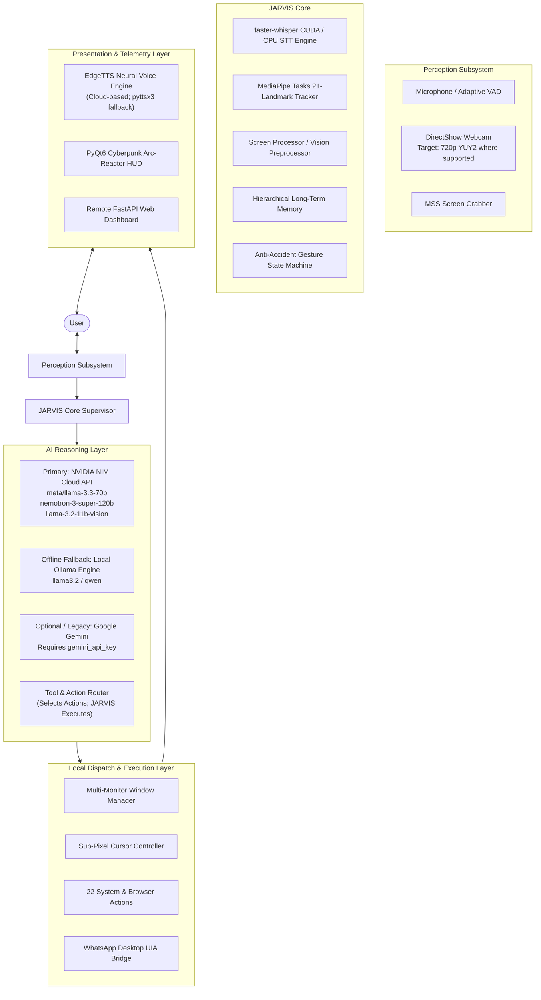

# JARVIS (Mark II) — Autonomous AI Desktop Assistant

<div align="center">

```
                                                    ██╗ █████╗ ██████╗ ██╗   ██╗██╗███████╗     █████╗ ██╗
                                                    ██║██╔══██╗██╔══██╗██║   ██║██║██╔════╝    ██╔══██╗██║
                                                    ██║███████║██████╔╝██║   ██║██║███████╗    ███████║██║
                                               ██   ██║██╔══██║██╔══██╗╚██╗ ██╔╝██║╚════██║    ██╔══██║██║
                                               ╚█████╔╝██║  ██║██║  ██║ ╚████╔╝ ██║███████║    ██║  ██║██║
                                                ╚════╝ ╚═╝  ╚═╝╚═╝  ╚═╝  ╚═══╝  ╚═╝╚══════╝    ╚═╝  ╚═╝╚═╝
```

### *Just A Rather Very Intelligent System*
**Next-Generation Multimodal AI Desktop Assistant for Windows**

[](https://github.com/BitCrush777/Jarvis-Ai-Assistant/stargazers)
[](https://www.python.org/)
[](https://www.microsoft.com/windows)
[](https://build.nvidia.com/)
[](https://developers.google.com/mediapipe)
[-brightgreen?style=for-the-badge&logo=checkmarx)](tests/)
[](LICENSE)

[Features](#-key-features) • [Architecture](#-system-architecture) • [AI Providers](#-ai--nvidia-nim-integration) • [Gestures](#-high-precision-hand-gesture-control) • [Quick Start](#-quick-start-guide) • [Configuration](#-configuration-reference) • [Limitations](#-known-limitations--hardware-dependencies) • [Diagnostics](#-troubleshooting--diagnostics)

</div>

---

## 🌟 Executive Overview

**Jarvis Ai Assistant** (Mark II) is an autonomous, multimodal personal AI agent engineered specifically as a local AI operating layer for Microsoft Windows. Moving beyond standard text-based chat windows, JARVIS is an operating-system-level companion that perceives your voice, tracks hand landmarks via webcam computer vision, observes your active displays, manages multi-monitor workflows, automates complex desktop tasks, and interfaces with external messaging channels like WhatsApp Desktop.

The system is designed around an **NVIDIA-first AI architecture** featuring a single-instance core supervisor with decoupled worker threads:
- **Primary Cloud Reasoning**: Powered by **NVIDIA NIM (Inference Microservice)** cloud APIs (`meta/llama-3.3-70b-instruct`, `nvidia/nemotron-3-super-120b-a12b`, `meta/llama-3.2-11b-vision-instruct`) for low-latency streaming conversation, visual screen analysis, and tool routing.
- **Local Offline Reasoning**: Built-in support for **Ollama** (`llama3.2`) for fully offline, private intelligence.
- **Optional / Legacy Cloud Fallback**: Google Gemini (`google-genai`) integration remains supported in the codebase for Gemini Live streaming audio and grounded web search if a `gemini_api_key` is configured, but is **not required** for normal NVIDIA-based operation (DuckDuckGo handles web search by default).
- **Perception & Control**: Real-time 21-landmark hand tracking via Google **MediaPipe Tasks**, low-latency **faster-whisper** CUDA speech recognition, and an adaptive **OneEuroFilter** touchless cursor controller.

---

## ⚡ Key Features

| Subsystem | Capabilities | Technology Stack |
|---|---|---|
| **🧠 Hybrid Intelligence** | Primary cloud reasoning via NVIDIA NIM (`meta/llama-3.3-70b-instruct`, `nemotron-3-super-120b`, `llama-3.2-11b-vision`), local offline inference via Ollama (`llama3.2`), and optional Gemini Live fallback. | NVIDIA NIM, Ollama, Google GenAI (Optional) |
| **🖐️ Touchless Gestures** | Mode-negotiated webcam capture (probing DirectShow up to 720p HD @ 30 FPS), real-time 21-landmark hand tracking, `OneEuroFilter` jitter suppression, anti-aliased HUD skeleton rendering, and cursor navigation. | MediaPipe Tasks, OpenCV, DirectShow |
| **🎙️ Voice Conversation** | Full-duplex conversational voice loop with continuous adaptive energy VAD, low-latency speech-to-text (`faster-whisper` on CUDA 12 / CPU INT8), neural speech synthesis (`EdgeTTS`), and hardware self-echo gating. | `faster-whisper` (CUDA 12 / CPU INT8), `EdgeTTS`, `sounddevice` |
| **🖥️ Multi-Monitor Hub** | Dynamic display topology scanning, cross-monitor window migration with proportional resolution scaling, and gesture window cycling (`Alt+Tab`). | Win32 APIs, `pywin32`, `pygetwindow` |
| **📞 WhatsApp Voice Bridge** | Automated contact calling via native Windows UI Automation (UIA), WASAPI loopback capture, and two-way voice bridging with Virtual Audio Cable. | `uiautomation`, WASAPI Loopback, VB-Audio Cable |
| **🤖 Autonomous Dev Agent** | Self-directed coding assistant capable of inspecting codebases, executing test suites, analyzing errors, and proposing targeted bug fixes. | Python AST, Subprocess Sandboxing |
| **💻 Cyberpunk HUD & Web** | PyQt6 dark neon arc-reactor interface with reactive audio waveforms, embedded live camera feed, and an encrypted FastAPI mobile web dashboard. | PyQt6, FastAPI, WebSockets, `cryptography` |

---

## 🏗️ System Architecture



---

## 🖥️ Cyberpunk Heads-Up Display (PyQt6)

The primary interface is a custom-engineered, dark-neon cyberpunk HUD rendered using hardware-accelerated **PyQt6** (`ui.py`):

```text
+---------------------------------------------------------------------------------------+
|  J.A.R.V.I.S.  ::  AUTONOMOUS DESKTOP INTELLIGENCE                       [ - ][ □ ][ X ] |
+---------------------------------------------------------------------------------------+
|  [ SYSTEM GAUGES ]       |                  [ ARC REACTOR ]                  |  [ GESTURE CONTROL ]   |
|  • CPU: 14% @ 3.8 GHz    |                 .---.     .---.                   |  • CAMERA: 1280x720    |
|  • RAM: 8.2 / 16.0 GB    |                /     \   /     \                  |  • STATUS: ONLINE      |
|  • GPU: RTX 3050 (32°C)  |               |   (•) | | (•)   |                 |  • LANDMARKS: 21 PTS   |
|  • VAD: SPEECH DETECTED  |                \     /   \     /                  |  • POSE: POINTING      |
|  • LLM: NVIDIA NIM 70B   |                 '---'     '---'                   |  • FILTER: OneEuro     |
|                          |            [ REACTIVE AUDIO WAVE ]                |  +-------------------+ |
|  [ ACTIVE WINDOW ]       |      ~~/\~~/\__/\~~/\__/\~~/\~~/\__/\~~           |  | [LIVE PREVIEW]    | |
|  • Code Editor (Display 1|                                                   |  | • Cyan Reticle    | |
|  • Size: 1920x1080       |  "All systems operational, Sir.                   |  | • Fingertip Halos | |
|  • Target Monitor: 2     |   Awaiting your voice or gesture command."        |  +-------------------+ |
+---------------------------------------------------------------------------------------+
|  [TERMINAL TELEMETRY]                                                                 |
|  [14:02:10] [Gesture] Switched active focus to 'Google Chrome' (Display 2).           |
|  [14:02:15] [NVIDIA] Stream response received via meta/llama-3.3-70b-instruct.       |
|  [14:02:18] [Audio] Audio capture loopback active. Hardware echo gating engaged.     |
+---------------------------------------------------------------------------------------+
```

---

## 🖐️ High-Precision Hand Gesture Control

The vision pipeline captures video via DirectShow (`cv2.CAP_DSHOW`), probing candidate modes (`1280x720`, `1920x1080`, `960x540`, `640x480`) in YUY2/MJPG and locking into native 720p HD where supported by physical hardware. If high-definition modes are unavailable on the device, the pipeline gracefully falls back to standard 640x480.

Hand tracking utilizes Google **MediaPipe Tasks HandLandmarker** in `VIDEO` running mode, detecting 21 normalized coordinates per hand on every frame. Processing runs entirely in a decoupled background thread, isolating computer vision inference from the PyQt6 GUI render loop.

### Dual-Stage OneEuroFilter
To resolve the dilemma between hovering stability and fast-action responsiveness:
$$\text{Cutoff frequency: } f_c = f_{c,\text{min}} + \beta \cdot |\dot{x}|$$
- **At rest ($|\dot{x}| \to 0$)**: The filter applies an aggressive smoothing cutoff ($f_{c,\text{min}} = 1.2\text{ Hz}$), suppressing micro-tremor and sensor noise to produce a steady cursor.
- **During rapid motion ($|\dot{x}| \gg 0$)**: The filter dynamically increases the cutoff proportional to velocity ($\beta = 0.05$), following quick intentional gestures with low latency.

### Gesture Command Matrix

```text
   [ OPEN PALM ]          [ POINTING ]            [ PINCH ]              [ FIST ]
     Neutral                 Cursor                Left-Click /          Minimize
    (Re-Arms)               Control                 Drag Hold             Window
   
   🖐️                     👉                    🤏                    ✊
```

| Gesture | Biomechanical Pose Condition | Triggered System Action | Safety & Debounce |
|---|---|---|---|
| **POINT** | Index finger extended, remaining fingers curled | Sub-pixel cursor tracking across monitors | Clamped to active work box |
| **PINCH** | Distance(Thumb Tip, Index Tip) < 45 mm | Single Click (tap) / Drag-and-drop (hold > 0.25s) | Gated to pointing mode |
| **SWIPE RIGHT** | Rapid palm displacement ($\Delta x > +0.15$) | Navigate Next Application (`Alt + Tab`) | 0.6s cooldown debounce |
| **SWIPE LEFT** | Rapid palm displacement ($\Delta x < -0.15$) | Navigate Previous Application (`Alt + Shift + Tab`) | 0.6s cooldown debounce |
| **FIST** | All 5 fingertips curled toward palm | Minimize Active Window | Single-fire execution lock |
| **TWO FINGER** | Index + Middle extended, Ring/Pinky curled | Enter / Exit Multi-Monitor Mode | Confirmation hysteresis |
| **THUMBS UP** | Thumb extended vertically, fist curled | Confirm Dialog / Press `Enter` | Neutral re-arm required |
| **THUMBS DOWN**| Thumb pointing downward, fist curled | Cancel / Press `Escape` | Neutral re-arm required |
| **OPEN PALM** | All 5 fingers extended and spread | Neutral baseline state | Re-arms gesture detector |

---

## 🧠 AI & NVIDIA NIM Integration

JARVIS adopts an **NVIDIA-first AI architecture**, leveraging the **NVIDIA NIM (Inference Microservice)** cloud API platform as its primary intelligence backend. NVIDIA NIM provides high-throughput streaming inference, structured JSON output, and function calling over an OpenAI-compatible interface.

### Primary NVIDIA Models
- **`meta/llama-3.3-70b-instruct`** — Primary cloud reasoning, natural dialogue, tool routing, and function calling.
- **`nvidia/nemotron-3-super-120b-a12b`** — High-complexity logical analysis, deep planning, and coding assistance.
- **`meta/llama-3.2-11b-vision-instruct`** — Multimodal desktop screenshot inspection and visual UI analysis.

### Configuration
Edit `config/api_keys.json` with your credentials:

```json
{
    "nvidia_api_key": "YOUR_NVIDIA_API_KEY_HERE",
    "llm_provider": "nvidia",
    "llm_model": "meta/llama-3.3-70b-instruct",
    "llm_url": "https://integrate.api.nvidia.com/v1"
}
```

> [!NOTE]
> Any key beginning with `nvapi-` is automatically routed with standard `Bearer` authorization headers to NVIDIA NIM endpoints.

### Offline Local Fallback (Ollama)
When operating without internet access or in privacy-sensitive environments, set `"llm_provider": "ollama"` and `"llm_model": "llama3.2"` in `config/api_keys.json`. JARVIS connects to your local Ollama daemon at `http://localhost:11434`, ensuring full local execution without external network calls.

### Optional / Legacy Provider (Google Gemini)
Code for Google Gemini (`google-genai`) remains supported in `main.py`, `dashboard/server.py`, and `actions/web_search.py` as an optional / legacy fallback. If a user sets `"llm_provider": "gemini"` and provides a `"gemini_api_key"`, JARVIS can utilize Gemini Live streaming voice and Gemini grounded search. **JARVIS does not require a Gemini API key for normal operation**; by default, NVIDIA NIM handles reasoning and DuckDuckGo (`ddgs`) handles web searches.

---

## 🎙️ Voice & Audio Pipeline

1. **Adaptive Energy VAD**: Continuous ambient noise floor tracking. Automatically filters out background keyboard typing and ambient room noise while latching onto vocal pitch.
2. **Speech-to-Text (STT)**: Utilizes `faster-whisper` on NVIDIA CUDA 12 for low-latency local speech transcription. Automatically falls back to INT8 quantization on CPU if CUDA is unavailable.
3. **Neural TTS**: Synthesizes expressive, natural voice responses via Microsoft `EdgeTTS` (`en-US-GuyNeural`) with low-latency streaming playback via `miniaudio` and `pygame`. (Requires an active internet connection; falls back to offline `pyttsx3` if configured or disconnected).
4. **Hardware Self-Echo Gating**: While JARVIS is speaking, audio capture is automatically gated to prevent the assistant from listening to and transcribing its own synthesized voice.

---

## 🖥️ Window & Multi-Monitor Choreography

Controlled via `core/window_manager.py`:
- Detects virtual desktop geometry across all attached monitors via Win32 `EnumDisplayMonitors`.
- Migrates windows between monitors proportionally, recalculating window bounds so that relative scale and positioning are maintained across mismatched resolutions (e.g. moving a window from a 1080p display to a 1440p display).
- Safe boundary clamping prevents moving windows into off-screen coordinates or taskbar boundaries.

---

## 📞 WhatsApp Desktop Voice Bridge

Implemented in `plugins/whatsapp_voice_bridge.py`:
- Interacts directly with native Windows **WhatsApp Desktop** using Microsoft UI Automation (`uiautomation`).
- Monitors incoming calls and verifies call states (`CONNECTING`, `CALLING`, `CONNECTED`, `ENDED`) without browser scraping or unofficial API reverse-engineering.
- Injects synthesized voice into WhatsApp calls via a Virtual Audio Cable (`CABLE Output`) while capturing caller responses through WASAPI loopback audio.

---

## 🛠️ Action & Tool Registry

JARVIS ships with 22 modular action controllers in `actions/`:

```text
actions/
├── background_monitor.py   # Background health & process watcher
├── browser_control.py      # Playwright browser driver & web automation
├── code_helper.py          # Python syntax analysis & code generation
├── computer_control.py     # Windows volume, sleep, lock, keyboard shortcuts
├── computer_settings.py    # Display, network, and audio endpoint management
├── desktop.py              # Shortcut organizer & desktop layout management
├── dev_agent.py            # Autonomous software testing and repair agent
├── file_controller.py      # Safe file creation, reading, and send2trash routing
├── file_processor.py       # Document summarization (PDF, PPTX, TXT)
├── flight_finder.py        # Travel & flight pricing lookups
├── game_updater.py         # Automated game client patcher
├── open_app.py             # Application launcher with fuzzy name resolution
├── proactive.py            # Context-aware user suggestions
├── pushup_counter.py       # Vision-based fitness counter
├── reminder.py             # System toast notifications & timer alarms
├── screen_processor.py     # Desktop screenshot capture & visual analysis
├── send_message.py         # System notification message dispatcher
├── system_monitor.py       # Real-time CPU, RAM, GPU, battery, and disk telemetry
├── upload_video.py         # Media publishing automator
├── weather_report.py       # Atmospheric forecasting
├── web_search.py           # DuckDuckGo clean search (Gemini grounded fallback)
└── youtube_video.py        # YouTube search, playback, and transcript extraction
```

---

## 🚀 Quick Start Guide

### Prerequisites
- **Operating System**: Windows 10 or Windows 11 (64-bit).
- **Python**: Python 3.11 recommended.
- **Hardware**: Integrated or USB Webcam, Microphone, and Audio Output.
- *(Optional)*: NVIDIA GPU with CUDA 12 for hardware-accelerated Whisper STT.
- *(Optional for WhatsApp)*: [VB-Audio Virtual Cable](https://vb-audio.com/Cable/).

### 1. Clone the Repository
```powershell
git clone https://github.com/BitCrush777/Jarvis-Ai-Assistant.git
cd Jarvis-Ai-Assistant
```

### 2. Create and Activate Virtual Environment
```powershell
python -m venv .venv
.\.venv\Scripts\activate
```

### 3. Install Dependencies
```powershell
pip install -r requirements.txt
```

*(Optional: Enable CUDA 12 GPU acceleration for Whisper)*:
```powershell
pip install torch torchaudio --index-url https://download.pytorch.org/whl/cu121
```

### 4. Create Local Configuration
Copy the safe configuration template:
```powershell
Copy-Item config\api_keys.example.json config\api_keys.json
```

Open `config/api_keys.json` and insert your NVIDIA API key or configure local Ollama settings:
```json
{
    "nvidia_api_key": "YOUR_NVIDIA_API_KEY_HERE",
    "llm_provider": "nvidia",
    "llm_model": "meta/llama-3.3-70b-instruct",
    "camera_resolution": "auto",
    "target_fps": 30
}
```

### 5. Launch JARVIS
```powershell
python main.py
```
*Or double-click `run.bat`.*

---

## ⚙️ Configuration Reference

All settings are managed via `config/api_keys.json` (untracked and protected by `.gitignore`):

| Key | Type | Default | Description |
|---|---|---|---|
| `nvidia_api_key` | `string` | `""` | NVIDIA NIM Cloud API key (`nvapi-...`) |
| `llm_provider` | `string` | `"nvidia"` | Model provider: `"nvidia"`, `"ollama"`, or `"gemini"` |
| `llm_model` | `string` | `"meta/llama-3.3-70b-instruct"` | Model identifier |
| `llm_url` | `string` | `"https://integrate.api.nvidia.com/v1"` | API base endpoint |
| `assistant_name` | `string` | `"JARVIS"` | Activation name |
| `user_name` | `string` | `"User"` | Preferred user honorific |
| `tts_engine` | `string` | `"edgetts"` | TTS engine: `"edgetts"` or `"pyttsx3"` |
| `tts_voice` | `string` | `"en-US-GuyNeural"` | Speech voice name |
| `whisper_model` | `string` | `"base"` | Whisper model size: `tiny`, `base`, `small`, `medium` |
| `camera_index` | `int` | `0` | DirectShow hardware camera device index |
| `camera_resolution` | `string` | `"auto"` | Resolution negotiation: `"auto"`, `[1280, 720]`, `[640, 480]` |
| `camera_mirror` | `bool` | `true` | Mirror camera feed horizontally |
| `target_fps` | `int` | `30` | Camera capture framerate target |
| `gesture_control.enabled` | `bool` | `true` | Master toggle for gesture recognition |
| `gesture_control.confidence_threshold` | `float` | `0.65` | Minimum classification confidence |
| `gesture_control.cooldown_seconds` | `float` | `0.6` | Cooldown period between action triggers |
| `cursor_control.enabled` | `bool` | `true` | Hand-driven cursor navigation toggle |
| `cursor_control.dead_zone_px` | `float` | `2.5` | Sub-pixel jitter deadzone |
| `cursor_control.min_cutoff` | `float` | `1.2` | OneEuroFilter minimum cutoff frequency |
| `cursor_control.beta` | `float` | `0.05` | OneEuroFilter velocity responsiveness slope |

---

## 🔒 Security & Privacy Architecture

JARVIS maintains strict technical separation between local processing and cloud AI queries:

- **Local-First Perception**: Microphone audio capture, adaptive VAD, local `faster-whisper` speech transcription, webcam capture, and MediaPipe hand tracking are processed entirely in-memory on your local machine. Raw camera streams and ambient room audio are **never** streamed to cloud servers.
- **Cloud AI Boundaries**: When you issue a voice query or trigger a desktop action, only the transcribed text prompt (and an encrypted screen capture if visual inspection is explicitly requested) is transmitted over TLS to your configured AI provider (NVIDIA NIM cloud endpoint or local Ollama).
- **Zero Committed Secrets**: `.gitignore` strictly protects `config/api_keys.json`, SSL certificates (`config/certs/`), `.env` files, and local user memory (`memory/*.json`).
- **Sandbox Action Whitelist**: All gesture and voice commands pass through an execution whitelist before reaching Windows shell APIs. Dangerous shell commands (`format`, `rmdir`, `shutdown`, arbitrary PowerShell executions) are strictly blocked.
- **Local Data Sovereignty**: User memory profiles and conversation history reside in local JSON files under `memory/` on your disk.

---

## ⚠️ Known Limitations & Hardware Dependencies

- **Operating System Dependency**: JARVIS is built specifically for Microsoft Windows 10/11 (64-bit). It relies on Win32 API display topology, DirectShow COM interfaces, WASAPI audio loopback, and Windows UI Automation.
- **Camera Resolution & Frame Rate**: The negotiated camera resolution (targeting 720p HD @ 30 FPS) and tracking responsiveness depend on your physical webcam sensor capabilities, driver DirectShow implementation, and ambient lighting. Unsupported modes gracefully fall back to 640x480.
- **Whisper Real-Time Performance**: GPU acceleration requires an NVIDIA GPU with CUDA 12 drivers. CPU INT8 fallback is fully supported but may introduce higher transcription latency depending on CPU core count.
- **Cloud Connectivity & Offline Mode**: Standard cloud reasoning via NVIDIA NIM and EdgeTTS requires an active internet connection. Fully offline operation requires running a local Ollama instance (`ollama serve`) and setting `tts_engine: "pyttsx3"`.
- **WhatsApp Voice Bridge**: Requires **WhatsApp Desktop** for Windows to be installed and active, along with [VB-Audio Virtual Cable](https://vb-audio.com/Cable/) configured as the WhatsApp microphone for bidirectional audio routing.

---

## 🩺 Troubleshooting & Diagnostics

JARVIS includes a standalone 7-stage automated diagnostic suite to audit hardware and safety components without launching the full GUI:

```powershell
python tools/camera_gesture_diagnostic.py --all-headless
```

### Sample Automated Diagnostic Output (Measured on local test hardware)
```text
======================================================================
  JARVIS DIAGNOSTIC: DIAGNOSTIC SUMMARY MATRIX
======================================================================
COMPONENT                      STATUS
--------------------------------------------------
Enumerate                      [PASS] (USB2.0 HD UVC WebCam @ 1280x720)
Test A (Capture)               [PASS] (DirectShow 1280x720 YUY2)
Test B (Tracking)              [PASS] (21 Landmarks via MediaPipe Tasks)
Test C (Gestures)              [PASS] (Static Poses & Dynamic Swipes)
Test D (Actions)               [PASS] (Whitelist Sandbox Security)
Test E (Cursor)                [PASS] (OneEuroFilter Jitter Suppression)
Test F (Monitors)              [PASS] (Display Topology & Geometry)
--------------------------------------------------

[PASS] ALL 7 DIAGNOSTIC TESTS PASSED SUCCESSFULLY.
```
*(Note: Actual FPS, latency, and camera parameters depend on connected hardware and driver capabilities).*

### Running Unit Tests
To verify all 127 subsystem test cases locally:
```powershell
python -m unittest discover -s tests
```
*(All 127 tests pass locally on reference test environments).*

---

## 🗺️ Project Roadmap

- [x] **NVIDIA-First AI Architecture**: Streaming cloud inference via NVIDIA NIM (`meta/llama-3.3-70b-instruct`, `nemotron-3-super-120b`).
- [x] **Intelligent Camera Negotiation**: DirectShow mode probing targeting 720p HD with graceful fallback.
- [x] **Touchless Cursor Navigation**: Dual-stage OneEuroFilter smoothing and sub-pixel precision.
- [x] **WhatsApp Desktop Voice Bridge**: Native Windows UI Automation and WASAPI audio loopback.
- [x] **Multi-Monitor Choreography**: Display topology scanning and proportional window migration.
- [x] **Comprehensive Hardware Diagnostics**: Headless 7-stage diagnostic suite and 127 automated unit tests.
- [ ] **Bimanual Gestures**: Two-hand pinch-to-zoom and multi-hand gestures.
- [ ] **Local Small Vision Model**: Embedded Moondream2 / Ollama vision for fully offline vision reasoning.
- [ ] **Cross-Platform Linux Support**: Wayland / X11 display backend and PipeWire audio pipeline.

---

## 📄 License

This project is licensed under the **MIT License** — see the [LICENSE](LICENSE) file for details.

---

<div align="center">

**Built with passion by [Saidarshan.K (BitCrush777)](https://github.com/BitCrush777)**

*Star ⭐ this repository if JARVIS makes your desktop experience feel like the future!*

</div>
