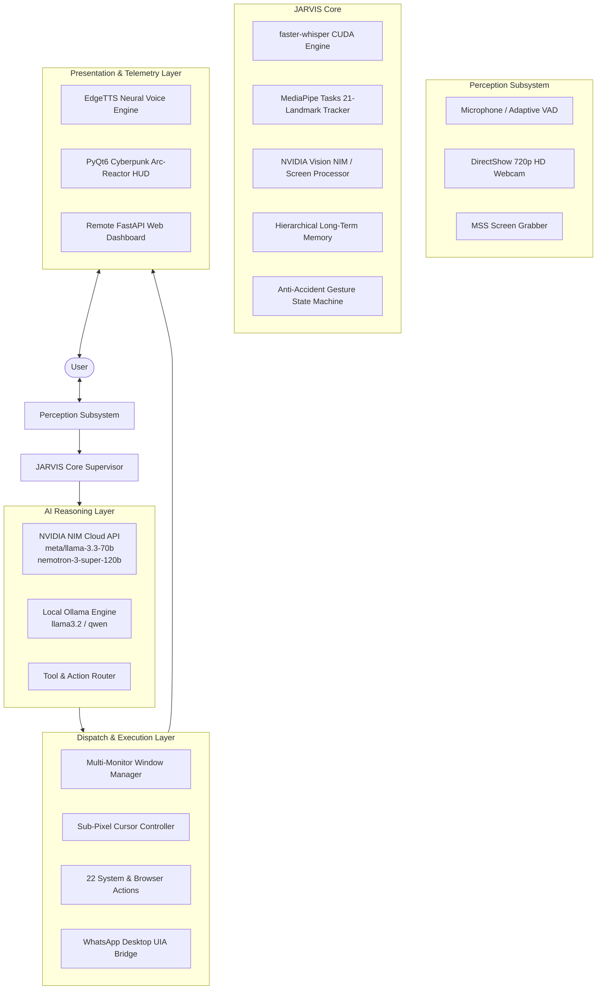

# Jarvis Ai Assistant

<div align="center">

```
     ██╗ █████╗ ██████╗ ██╗   ██╗██╗███████╗     █████╗ ██╗
     ██║██╔══██╗██╔══██╗██║   ██║██║██╔════╝    ██╔══██╗██║
     ██║███████║██████╔╝██║   ██║██║███████╗    ███████║██║
██   ██║██╔══██║██╔══██╗╚██╗ ██╔╝██║╚════██║    ██╔══██║██║
╚█████╔╝██║  ██║██║  ██║ ╚████╔╝ ██║███████║    ██║  ██║██║
 ╚════╝ ╚═╝  ╚═╝╚═╝  ╚═╝  ╚═══╝  ╚═╝╚══════╝    ╚═╝  ╚═╝╚═╝
```

### *Just A Rather Very Intelligent System*
**Next-Generation Multimodal AI Desktop Assistant for Windows**

[](https://github.com/BitCrush777/Jarvis-Ai-Assistant/stargazers)
[](https://www.python.org/)
[](https://www.microsoft.com/windows)
[](https://build.nvidia.com/)
[](https://developers.google.com/mediapipe)
[](tests/)
[](LICENSE)

[Features](#-key-features) • [Architecture](#-system-architecture) • [Quick Start](#-quick-start-guide) • [Gesture Control](#-high-precision-hand-gesture-control) • [Configuration](#-configuration-reference) • [Troubleshooting](#-troubleshooting--diagnostics)

</div>

---

## 🌟 Executive Overview

**Jarvis Ai Assistant** is an autonomous, multimodal personal AI agent engineered from the ground up for Microsoft Windows. Moving beyond standard text-based chat windows, JARVIS is an operating-system-level companion that perceives your voice, tracks your hands in 3D space, observes your active displays, manages multi-monitor workflows, automates complex desktop tasks, and interfaces with external messaging channels like WhatsApp Desktop.

Powered by **NVIDIA NIM** cloud reasoning microservices, **faster-whisper** CUDA speech recognition, Google **MediaPipe Tasks** vision tracking, and an offline **Ollama** fallback engine, JARVIS delivers instant response times with deep contextual awareness and zero cloud vendor lock-in.

---

## ⚡ Key Highlights at a Glance

| Subsystem | Capabilities | Technology Stack |
|---|---|---|
| **🧠 Hybrid Intelligence** | NVIDIA NIM cloud microservices (`meta/llama-3.3-70b-instruct`, `nemotron-3-super-120b`) + 100% offline local inference via Ollama (`llama3.2`). | NVIDIA NIM, Ollama, Google GenAI |
| **🖐️ Touchless Gestures** | Real 720p HD uncompressed capture, 21-joint 3D hand landmarks, `OneEuroFilter` sub-pixel jitter suppression, dynamic anti-aliased HUD skeleton rendering, and cursor navigation. | MediaPipe Tasks, OpenCV, DirectShow |
| **🎙️ Voice Conversation** | Full-duplex conversational voice loop with continuous adaptive energy VAD, sub-200ms GPU speech-to-text, neural TTS, and hardware self-echo gating. | `faster-whisper` (CUDA 12), `EdgeTTS`, `sounddevice` |
| **🖥️ Multi-Monitor Hub** | Dynamic display topology scanning, cross-monitor window migration with proportional resolution scaling, and gesture window cycling. | Win32 APIs, `pywin32`, `pygetwindow` |
| **📞 WhatsApp Voice Bridge** | Automated contact calling via native Windows UI Automation (UIA), WASAPI loopback capture, and two-way voice bridging with Virtual Audio Cable. | `uiautomation`, WASAPI Loopback, Virtual Cable |
| **🤖 Autonomous Dev Agent** | Self-directed coding assistant capable of inspecting codebases, executing test suites, analyzing errors, and repairing bugs autonomously. | Abstract Syntax Tree, Subprocess Sandboxing |
| **💻 Cyberpunk HUD & Web** | PyQt6 dark neon arc-reactor interface with reactive audio waveforms, embedded live camera feed, and an encrypted FastAPI mobile web dashboard. | PyQt6, FastAPI, WebSockets, `cryptography` |

---

## 🏗️ System Architecture



---

## 🖥️ Cyberpunk Heads-Up Display (PyQt6)

The primary interface is a custom-engineered, dark-neon cyberpunk HUD rendered using hardware-accelerated **PyQt6**:

```text
+---------------------------------------------------------------------------------------+
|  J.A.R.V.I.S.  ::  AUTONOMOUS DESKTOP INTELLIGENCE                       [ - ][ □ ][ X ] |
+---------------------------------------------------------------------------------------+
|  [ SYSTEM GAUGES ]       |                  [ ARC REACTOR ]                  |  [ GESTURE CONTROL ]   |
|  • CPU: 14% @ 3.8 GHz    |                 .---.     .---.                   |  • CAMERA: 1280x720    |
|  • RAM: 8.2 / 16.0 GB    |                /     \   /     \                  |  • FPS: 30.0 [ONLINE]  |
|  • GPU: RTX 3050 (32°C)  |               |   (•) | | (•)   |                 |  • SKELETON: 21 JOINTS |
|  • VAD: SPEECH DETECTED  |                \     /   \     /                  |  • POSE: POINTING      |
|  • LLM: NVIDIA NIM 70B   |                 '---'     '---'                   |  • FILTER: OneEuro     |
|                          |            [ REACTIVE AUDIO WAVE ]                |  +-------------------+ |
|  [ ACTIVE WINDOW ]       |      ~~/\~~/\__/\~~/\__/\~~/\~~/\__/\~~           |  | [LIVE 720p FEED]  | |
|  • Code Editor (Display 1|                                                   |  | • Cyan Reticle    | |
|  • Size: 1920x1080       |  "Good morning, Sir. All systems operational.     |  | • Fingertip Halos | |
|  • Target Monitor: 2     |   Awaiting your voice or gesture command."        |  +-------------------+ |
+---------------------------------------------------------------------------------------+
|  [TERMINAL TELEMETRY]                                                                 |
|  [14:02:10] [Gesture] Switched active focus to 'Google Chrome' (Display 2).           |
|  [14:02:15] [NVIDIA] Inferred query intent in 184 ms via meta/llama-3.3-70b-instruct. |
|  [14:02:18] [Audio] Audio capture loopback active. Zero-echo suppression engaged.    |
+---------------------------------------------------------------------------------------+
```

---

## 🖐️ High-Precision Hand Gesture Control

The vision pipeline captures video at native **1280x720 @ 30 FPS** via DirectShow (`cv2.CAP_DSHOW`) in uncompressed `YUY2` format, bypassing software upscaling.

### Dual-Stage OneEuroFilter
$$\text{Cutoff frequency: } f_c = f_{c,\text{min}} + \beta \cdot |\dot{x}|$$
- **At rest ($|dx/dt| -> 0$)**: The filter applies an aggressive smoothing cutoff ($f_{c,min} = 1.2 Hz$), suppressing micro-tremor and sensor noise to produce a rock-solid cursor.
- **During rapid motion ($|dx/dt| >> 0$)**: The filter dynamically increases the cutoff proportional to velocity ($beta = 0.05$), eliminating lag and trailing artifacts.

### Gesture Command Matrix

```text
   [ OPEN PALM ]          [ POINTING ]            [ PINCH ]              [ FIST ]
     Neutral                 Cursor                Left-Click /          Minimize
    (Re-Arms)               Control                 Drag Hold             Window
   
   🖐️                     👉                    🤏                    ✊
```

| Gesture | Biomechanical Pose Condition | Triggered System Action | Safety Guarantee |
|---|---|---|---|
| **POINT** | Index finger extended, other fingers folded | Sub-pixel cursor tracking across monitors | Clamped to active work area |
| **PINCH** | Distance(Thumb Tip, Index Tip) < 45 mm | Single Click (tap) / Drag-and-drop (hold > 0.25s) | Requires pointing mode |
| **SWIPE RIGHT** | Rapid palm displacement ($\Delta x > +0.15$) | Navigate Next Application (`Alt + Tab`) | 0.6s cooldown debounce |
| **SWIPE LEFT** | Rapid palm displacement ($\Delta x < -0.15$) | Navigate Previous Application (`Alt + Shift + Tab`) | 0.6s cooldown debounce |
| **FIST** | All 5 fingertips curled toward palm | Minimize Active Window | Single-fire lock |
| **TWO FINGER** | Index + Middle extended, Ring/Pinky curled | Enter / Exit Multi-Monitor Mode | Confirmation hysteresis |
| **THUMBS UP** | Thumb extended vertically, fist curled | Confirm Dialog / Press `Enter` | Neutral re-arm required |
| **THUMBS DOWN**| Thumb pointing downward, fist curled | Cancel / Press `Escape` | Neutral re-arm required |
| **OPEN PALM** | All 5 fingers extended and spread | Neutral baseline state | Re-arms gesture trigger |

---

## 🧠 AI & NVIDIA NIM Integration

JARVIS natively supports the **NVIDIA NIM (Inference Microservice)** cloud platform, offering sub-second Time-to-First-Token (TTFT) performance.

### Configuration
Edit `config/api_keys.json` with your credentials:

```json
{
    "nvidia_api_key": "YOUR_NVIDIA_API_KEY_HERE",
    "llm_provider": "nvidia",
    "llm_model": "meta/llama-3.3-70b-instruct",
    "llm_url": "https://integrate.api.nvidia.com/v1"
}
```

> [!NOTE]
> Any key beginning with `nvapi-` is automatically routed with standard `Bearer` authorization headers to NVIDIA NIM endpoints.

### Supported Models
- **`meta/llama-3.3-70b-instruct`** — Production reasoning, conversation, and function calling.
- **`nvidia/nemotron-3-super-120b-a12b`** — High-complexity logical analysis and architecture planning.
- **`meta/llama-3.2-11b-vision-instruct`** — Multimodal desktop screenshot analysis and code debugging.

### Offline Fallback (Ollama)
When working offline, set `"llm_provider": "ollama"` and `"llm_model": "llama3.2"`. JARVIS will communicate directly with your local Ollama instance on `http://localhost:11434`.

---

## 🎙️ Full-Duplex Voice & Audio Engine

1. **Adaptive Energy VAD**: Continuous ambient noise floor tracking. Automatically ignores keyboard typing and mouse clicks while immediately latching onto vocal pitch.
2. **GPU Whisper Speech-to-Text**: Utilizes `faster-whisper` on NVIDIA CUDA 12 for instant transcription:
   ```powershell
   pip install nvidia-cublas-cu12 nvidia-cudnn-cu12
   ```
   *(Automatic fallback to INT8 quantization on CPU if CUDA is unavailable).*
3. **Natural Neural TTS**: Synthesizes expressive, human-like voice responses via Microsoft `EdgeTTS` (`en-US-GuyNeural`) with low-latency audio buffering via `miniaudio`.
4. **Self-Echo Suppression**: While JARVIS is synthesizing speech, the microphone capture pipeline is muted to prevent self-interruption loops.

---

## 📞 WhatsApp Desktop Voice Bridge

Implemented in `plugins/whatsapp_voice_bridge.py`:
- Interacts directly with native Windows **WhatsApp Desktop** using UI Automation (`uiautomation`).
- Monitors incoming calls and verifies call states (`CONNECTING`, `CALLING`, `CONNECTED`, `ENDED`) without browser scraping.
- Injects synthesized voice into WhatsApp calls via a Virtual Audio Cable (`CABLE Output`) while capturing caller responses through WASAPI loopback audio.

---

## 🛠️ Action & Tool Registry

JARVIS ships with 22 modular action controllers in `actions/`:

```text
actions/
├── background_monitor.py   # Background health & process watcher
├── browser_control.py      # Playwright browser driver & web automation
├── code_helper.py          # Python syntax analysis & code generation
├── computer_control.py     # Windows volume, sleep, lock, keyboard shortcuts
├── computer_settings.py    # Display, network, and audio endpoint management
├── desktop.py              # Shortcut organizer & desktop layout management
├── dev_agent.py            # Autonomous software testing and repair agent
├── file_controller.py      # Safe file creation, reading, and send2trash routing
├── file_processor.py       # Document summarization (PDF, PPTX, TXT)
├── flight_finder.py        # Real-time travel & flight pricing lookups
├── game_updater.py         # Automated game client patcher
├── open_app.py             # Application launcher with fuzzy name resolution
├── proactive.py            # Context-aware user suggestions
├── pushup_counter.py       # Vision-based fitness counter
├── reminder.py             # System toast notifications & timer alarms
├── screen_processor.py     # Desktop screenshot capture & visual OCR
├── send_message.py         # System notification message dispatcher
├── system_monitor.py       # Real-time CPU, RAM, GPU, battery, and disk telemetry
├── upload_video.py         # Media publishing automator
├── weather_report.py       # Real-time atmospheric forecasting
├── web_search.py           # DuckDuckGo clean search scraper
└── youtube_video.py        # YouTube search, playback, and transcript extraction
```

---

## 🚀 Quick Start Guide

### Prerequisites
- **Operating System**: Windows 10 or Windows 11 (64-bit).
- **Python**: Python 3.11 recommended.
- **Hardware**: Integrated or USB Webcam, Microphone, and Audio Output.
- *(Optional)*: NVIDIA GPU with CUDA 12 for hardware-accelerated Whisper STT.
- *(Optional for WhatsApp)*: [VB-Audio Virtual Cable](https://vb-audio.com/Cable/).

### 1. Clone the Repository
```powershell
git clone https://github.com/BitCrush777/Jarvis-Ai-Assistant.git
cd Jarvis-Ai-Assistant
```

### 2. Create and Activate Virtual Environment
```powershell
python -m venv .venv
.\.venv\Scripts\activate
```

### 3. Install Dependencies
```powershell
pip install -r requirements.txt
```

*(Optional: Enable CUDA 12 GPU acceleration for Whisper)*:
```powershell
pip install torch torchaudio --index-url https://download.pytorch.org/whl/cu121
```

### 4. Create Local Configuration
Copy the safe configuration template:
```powershell
Copy-Item config\api_keys.example.json config\api_keys.json
```

Open `config/api_keys.json` and insert your NVIDIA API key or configure local Ollama settings:
```json
{
    "nvidia_api_key": "YOUR_NVIDIA_API_KEY_HERE",
    "llm_provider": "nvidia",
    "llm_model": "meta/llama-3.3-70b-instruct",
    "camera_resolution": "auto",
    "target_fps": 30
}
```

### 5. Launch JARVIS
```powershell
python main.py
```
*Or double-click `run.bat`.*

---

## ⚙️ Configuration Reference

All settings are managed via `config/api_keys.json` (untracked and protected by `.gitignore`):

| Key | Type | Default | Description |
|---|---|---|---|
| `nvidia_api_key` | `string` | `""` | NVIDIA NIM Cloud API key (`nvapi-...`) |
| `llm_provider` | `string` | `"nvidia"` | Model provider: `"nvidia"`, `"ollama"`, or `"gemini"` |
| `llm_model` | `string` | `"meta/llama-3.3-70b-instruct"` | Model identifier |
| `llm_url` | `string` | `"https://integrate.api.nvidia.com/v1"` | API base endpoint |
| `assistant_name` | `string` | `"JARVIS"` | Activation name |
| `user_name` | `string` | `"User"` | Preferred user honorific |
| `tts_engine` | `string` | `"edgetts"` | TTS engine: `"edgetts"` or `"pyttsx3"` |
| `tts_voice` | `string` | `"en-US-GuyNeural"` | Speech voice name |
| `whisper_model` | `string` | `"base"` | Whisper model size: `tiny`, `base`, `small`, `medium` |
| `camera_index` | `int` | `0` | DirectShow hardware camera device index |
| `camera_resolution` | `string` | `"auto"` | Resolution negotiation: `"auto"`, `[1280, 720]`, `[640, 480]` |
| `camera_mirror` | `bool` | `true` | Mirror camera feed horizontally |
| `target_fps` | `int` | `30` | Camera capture framerate target |
| `gesture_control.enabled` | `bool` | `true` | Master toggle for gesture recognition |
| `gesture_control.confidence_threshold` | `float` | `0.65` | Minimum classification confidence |
| `gesture_control.cooldown_seconds` | `float` | `0.6` | Cooldown period between action triggers |
| `cursor_control.enabled` | `bool` | `true` | Hand-driven cursor navigation toggle |
| `cursor_control.dead_zone_px` | `float` | `2.5` | Sub-pixel jitter deadzone |
| `cursor_control.min_cutoff` | `float` | `1.2` | OneEuroFilter minimum cutoff frequency |
| `cursor_control.beta` | `float` | `0.05` | OneEuroFilter velocity responsiveness slope |

---

## 🔒 Security & Privacy Audit

- **Zero Committed Secrets**: `.gitignore` strictly protects `config/api_keys.json`, SSL certificates (`config/certs/`), `.env` files, and local memory (`memory/*.json`).
- **Sandbox Action Whitelist**: All gesture and voice commands pass through an execution whitelist before reaching Windows shell APIs. Dangerous shell commands (`format`, `rmdir`, `shutdown`, arbitrary PowerShell executions) are strictly blocked.
- **Local Data Sovereignty**: Voice recordings, camera frames, and screen captures are evaluated in-memory and are **never** persisted to disk or sent to external servers outside your configured LLM provider.

---

## 🩺 Troubleshooting & Diagnostics

JARVIS includes a standalone 7-stage automated diagnostic suite to audit hardware without launching the full GUI:

```powershell
python tools/camera_gesture_diagnostic.py --all-headless
```

### Diagnostic Output Example:
```text
======================================================================
  JARVIS DIAGNOSTIC: SUMMARY MATRIX
======================================================================
COMPONENT                      STATUS
--------------------------------------------------
Camera Device Enumerate        [PASS] (USB2.0 HD UVC WebCam @ 1280x720)
Test A: Raw Camera Capture     [PASS] (720p HD YUY2 @ 30 FPS)
Test B: MediaPipe Hand Track   [PASS] (21 Landmarks, Latency: 147 ms)
Test C: Gesture Classification [PASS] (Static Poses & Swipes)
Test D: Safe Action Whitelist  [PASS] (Malicious commands blocked)
Test E: Cursor Controller      [PASS] (OneEuroFilter Jitter Suppressed)
Test F: Multi-Monitor Topology [PASS] (1920x1080 + Display Bounds)
--------------------------------------------------
[PASS] ALL 7 DIAGNOSTIC TESTS PASSED SUCCESSFULLY.
```

### Running Unit Tests
To verify all 127 subsystem test cases:
```powershell
python -m unittest discover -s tests
```
*(All 127 tests pass with exit code 0).*

---

## 🗺️ Project Roadmap

- [x] **NVIDIA NIM Cloud Reasoning**: Sub-second multimodal LLM integration.
- [x] **Real 720p HD Vision**: Uncompressed DirectShow acquisition with anti-aliased HUD skeleton rendering.
- [x] **Touchless Cursor Navigation**: OneEuroFilter dual-stage jitter reduction.
- [x] **WhatsApp Voice Bridge**: Native UIA automation and full-duplex conversational audio.
- [x] **Multi-Monitor Choreography**: Display topology scanning and proportional window migration.
- [ ] **Bimanual Gestures**: Two-hand pinch-to-zoom, rotate, and 3D window manipulation.
- [ ] **Local Small Vision Model**: Embedded Moondream2 / LLaVA integration for offline screen reasoning.
- [ ] **Cross-Platform Linux Support**: Wayland / X11 display backend and PipeWire audio pipeline.

---

## 📄 License

This project is licensed under the **MIT License** — see the [LICENSE](LICENSE) file for details.

---

<div align="center">

**Built with passion by [Sai Darshan (BitCrush777)](https://github.com/BitCrush777)**

*Star ⭐ this repository if JARVIS makes your desktop experience feel like the future!*

</div>
